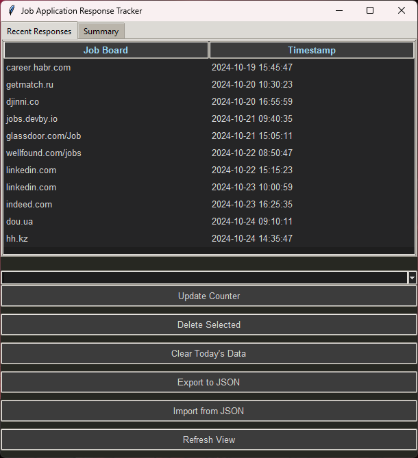
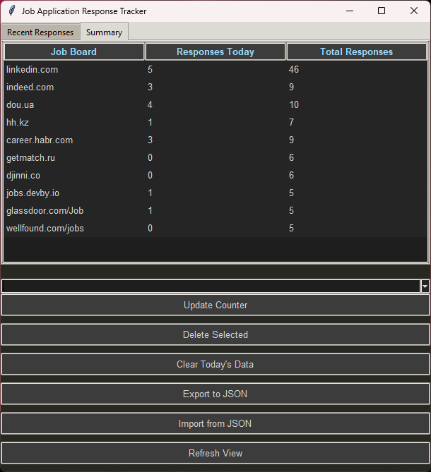

# Job Application Response Tracker v0.1

Простое приложение для отслеживания откликов на вакансии. Приложение позволяет отслеживать отклики самым легким способом: выберите интересующий вас джобборд, и после отправки заявки просто нажмите F9 для автоматической регистрации вашего отклика. Вы можете легко отслеживать ежедневный и суммарный прогресс по вашим откликам.

## Примеры экранов приложения

### Последние отклики


### Сводная информация



## Настройка проекта

### Клонирование репозитория
Сначала склонируйте репозиторий на ваш локальный компьютер:
```
git clone https://github.com/markbrutx/ApplicationTracker.git
```

### Настройка виртуального окружения
Для создания и активации виртуального окружения выполните следующие команды:

**Windows:**
```bash
python -m venv venv
.\venv\Scripts\activate
```

**macOS и Linux:**
```bash
python3 -m venv venv
source venv/bin/activate
```

### Установка зависимостей
Установите все необходимые зависимости из файла `requirements.txt`:
```
pip install -r requirements.txt
```

## Запуск приложения

Для запуска приложения выполните:
```
python main.py
```

Следуйте инструкциям на экране для использования приложения.

# Если хотите собрать .exe
```
pyinstaller --windowed --icon=app_icon.ico --name=JobTrackerApp2 main.py
```

## Планируемые фичи
- Возможность на хоткеи вставлять в поле Cover letter
- Исправить лаг для сборки при сохранении таблицы